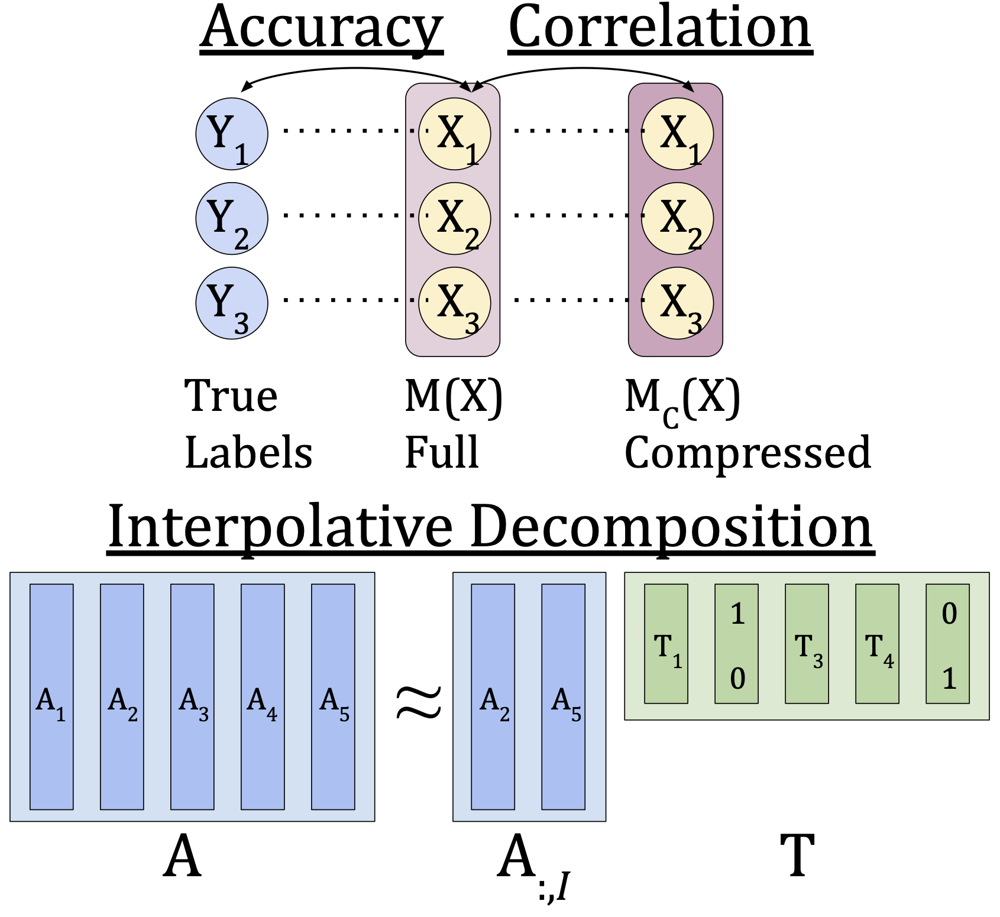

<p align="center">
  
  <br />
  <br />
  </p>
  
# Model Preserving Compression for Neural Networks

A pruning method for deep networks which preserves per-example decisions beyond top-1 accuracy, using the interpolative decomposition.
Our method determines per-layer compression ratios automatically, does not require fine-tuning, and can be trivially composed with any other compression method.

[NeurIPS Proceedings](https://openreview.net/pdf?id=gt-l9Hu2ndd)


---
Also look in `atom3d-Pruning.ipynb`, `ComparisonsNet.ipynb`, `Iter-PerClass-ClassRemoved-Figure.ipynb` for separate running examples.

First, we prune a pretrained model with ID:
```
from main import iditer, create_args
args = create_args()
args.arch = "VGG16" 
args.seed = 2
args.prune_batch_size = 5000
args.k = 0.95 # determines reduction amount for iditer algorithm per iteration
args.log_interval = 10
args.k_args = "iditer"
iditer(args, <savedir>)
```

Next, we compose another compression method. For PCA (see Appendix Table 4 for citation) see the following code. Note that `keep_ratio` is set to achieve a desired compression amount.
```
from pca import pca_prune
net = torch.load(<ID pruned model>)
try: 
    net = net.module
except: 
    net = net
pca_prune(net=net, keep_ratio=0.70, prune_size=5000, savename=<savename>)
```

For LRank (Appendix Table 4 for citation),
```
from lrank import lrank_prune
net = torch.load(<ID pruned model>)
try: 
    net = net.module
except: 
    net = net
lrank_prune(net=net, keep_ratio=0.984, prune_size=5000, savename=<savename>)
```

Finally to fine tune a compressed model, call the python `train.py` script with the appropriate paths for the compressed model path.
```
python train.py
    --arch vgg16 \
    --epochs <epochs> \
    --batch-size <batch size> \
    --lr <lr> \
    --momentum <momentum> \
    --weight-decay <weight decay> \
    --prune-batch-size 5000 \
    --print-freq 5000 \
    --workers 32 \
    --resume <checkpoint path/checkpoint.pth.tar> \
    --evalute \
    --pretrained <compressed model path> \
    --log_dir <logging output path> \
    --tensorboard_dir <tensorboard logging path> \
    --dist-url 'tcp://127.0.0.1:40781` \
    --dist-backend nccl \
    --seed 2 \
    --multiprocessing-distributed \
    --world-size 1 \
    --rank 0
```
